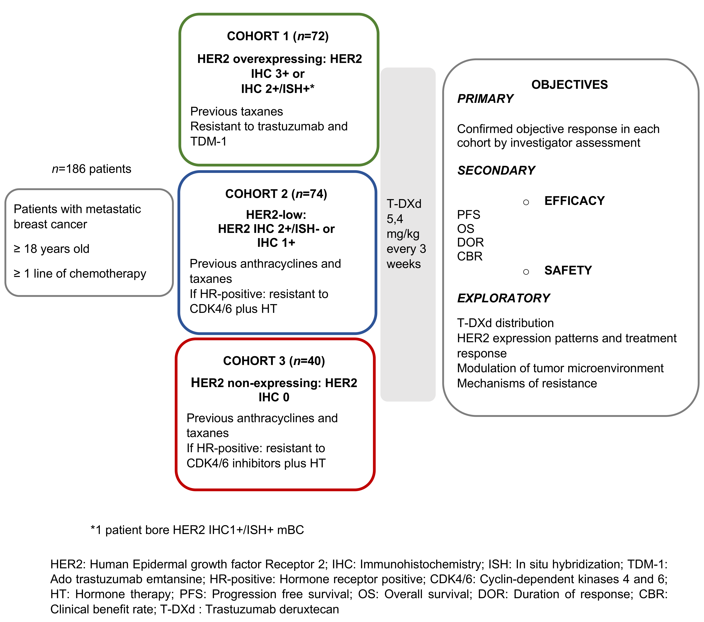

# Trastuzumab Deruxtecan in metastatic breast cancer with variable HER2 expression: the phase 2 DAISY trial
> Study of DS-8201a, an Antibody Drug Conjugate for Advanced Breast Cancer Patients, With Biomarkers Analysis

DAISY is a multicenter French clinical trial - [NCT04132960](https://www.clinicaltrials.gov/ct2/show/NCT04132960) - aiming
at assessing the efficacy of DS-8201a (Trastuzumab deruxtecan)  monotherapy in patients with metastatic breast cancer.

**Principal investigators**
- Pr. Fabrice ANDRÉ (fabrice.andre@gustaveroussy.fr)
- Dr. Fernanda MOSELE (mariafernanda.mosele@gustaveroussy.fr)
- Dr. Lusque AMELIE (lusque.amelie@iuct-oncopole.fr)
- Dr. Thomas FILLERON (filleron.thomas@iuct-oncopole.fr)

**Data coordinators**
- Dr. Marta JIMENEZ (m-jimenez@unicancer.fr)
- Dr. Céline MAHIER (c-mahier@unicancer.fr)

## Repository organisation

## data

This folder contains instructions and documents to be signed to get access to the data. Please see `data/README.md` for
more details.

## code

Contains all the code supporting the analyses presented in the paper. See `code/README.md` for more details.

# Contributors

- Bastien JOB <https://github.com/aoumess> bastien.job@gustaveroussy.fr
- Loic LE BESCOND <https://github.com/loic-lb> loic.le-bescond@centralesupelec.fr
- Yoann PRADAT <https://github.com/ypradat> yoann.pradat@gustaveroussy.fr
