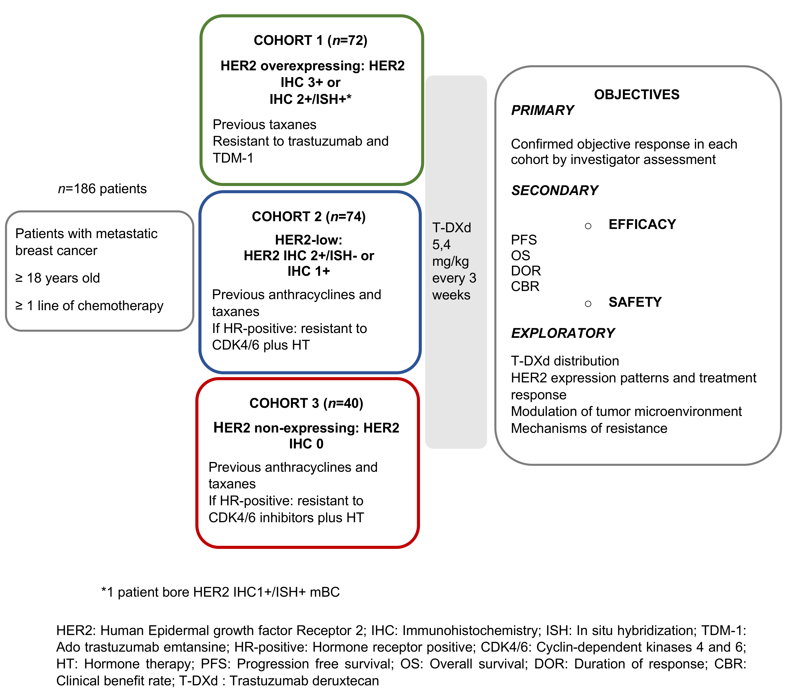

# DAISY
> Study of DS-8201a, an Antibody Drug Conjugate for Advanced Breast Cancer Patients, With Biomarkers Analysis

DAISY is a multicenter French clinical trial - [NCT04132960](https://www.clinicaltrials.gov/ct2/show/NCT04132960) - aiming
at assessing the efficacy of DS-8201a (Trastuzumab deruxtecan)  monotherapy in patients with metastatic breast cancer.

## Repository organisation

## pipelines

This folder hosts the bioinformatics pipelines that were used to run  bioinformatics analyses for the project. In short,

- `wes` a Snakemake pipeline. It performs a comprehensive analysis of WES data in order to identify, filter, and
  annotate somatic mutations, copy-number alterations, purity and ploidy in each pair of tumor/normal. It may also run
  in tumor-only mode for most all analyses. See `pipelines/wes/README.md` for more details.

## scripts

This folder gather all the scripts that were used to perform the analysis, extract the numbers, and draw the figures
that underlie the paper. Each analysis is organised in a subfolder using a structure similar to that of the
`pipelines/wes` pipeline. The code is organized and made easily runnable through Snakemake. See `scripts/REAMDE.md` for
more details.

# Contributors

- Bastien Job <https://github.com/aoumess>
- Loic Le Bescond <https://github.com/loic-lb>
- Yoann Pradat <https://github.com/ypradat>
